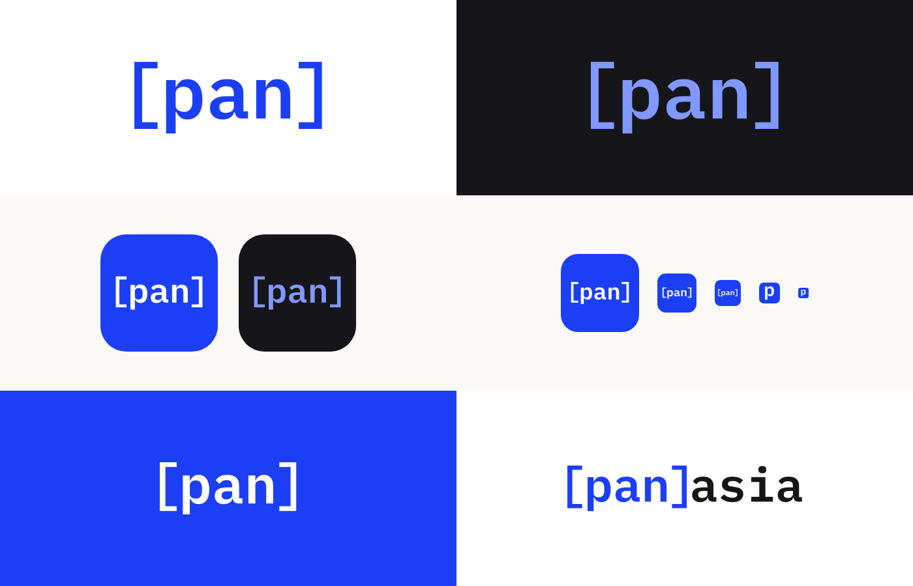

# Panasia 브랜드 가이드

## 로고

확정 로고는 **`[pan]asia`** 입니다.

- 서체: IBM Plex Mono SemiBold (SIL Open Font License)
- 글자는 모두 벡터 도형으로 변환되어 있어 폰트 설치 없이 그대로 쓸 수 있습니다.
- 괄호와 바깥 글자 사이 간격은 일반 글자 사이 간격과 같도록 조정했습니다. 로고를 텍스트로 다시 타이핑하지 말고 제공된 파일을 사용하세요.

| 형태 | 용도 |
|---|---|
| `[pan]asia` 가로형 | 기본. 웹사이트 헤더, 문서, 명함, 프레젠테이션 |
| `[pan]` / `asia` 세로형 | 정사각형에 가까운 공간 |
| `[pan]` 심볼 | 앱 아이콘, SNS 프로필, 굿즈 |
| `p` 파비콘 | 브라우저 탭 등 32px 이하 |

## 컬러

| 이름 | HEX | 쓰임 |
|---|---|---|
| Cobalt | `#1C3FF5` | 밝은 배경 위 `[pan]` |
| Ink | `#16161A` | 밝은 배경 위 `asia`, 본문 |
| Paper | `#FFFFFF` | 기본 배경, 어두운 배경 위 `asia` |
| Light Blue | `#8098FF` | 어두운 배경 위 `[pan]` |

- 밝은 배경: `[pan]` Cobalt + `asia` Ink → `panasia-primary`
- 어두운 배경: `[pan]` Light Blue + `asia` White → `panasia-reverse`
- 단색이 필요할 때: `panasia-black`, `panasia-white`

## 여백과 최소 크기

- **여백**: 로고 사방에 소문자 `a` 높이만큼의 빈 공간을 둡니다.
- **최소 크기**: 화면에서 가로 96px, 인쇄에서 가로 24mm 이상. 이보다 작으면 `[pan]` 심볼이나 `p` 파비콘을 씁니다.

## 하지 말 것

- 색을 바꾸거나 그라디언트·그림자·외곽선 넣기
- 늘리거나 눌러서 비율 바꾸기
- `[pan]`과 `asia`의 간격이나 크기 비율 바꾸기
- 다른 폰트로 다시 타이핑하기
- Cobalt `[pan]`을 검은 배경 위에 쓰기 (대비 부족 → `panasia-reverse` 사용)

## 파일 (`panasia-logo/`)

| 파일 | 내용 | 형식 |
|---|---|---|
| `panasia-primary` | 기본 (밝은 배경) | SVG, PNG 1200 / 2400 |
| `panasia-reverse` | 어두운 배경 | SVG, PNG 1200 / 2400 |
| `panasia-black`, `panasia-white` | 단색 | SVG, PNG 1200 |
| `panasia-stacked` | 세로형 | SVG, PNG 800 |
| `panasia-symbol` (+ `-reverse`, `-black`, `-white`) | `[pan]` 심볼 | SVG, PNG 800 (기본은 1600도 포함) |
| `panasia-icon`, `panasia-icon-dark` | `[pan]` 앱 아이콘 | SVG, PNG 1024 / 512 (+180) |
| `panasia-icon-p` | `[p]` 앱 아이콘 (대안) | SVG, PNG 1024 / 512 |
| `panasia-favicon` | `p` 파비콘 | SVG, PNG 64 / 32 / 16 |

PNG는 모두 투명 배경입니다. 전체 묶음은 `panasia-logo.zip`에 있습니다.

## 미정 사항

- **앱 아이콘**: 현재 기본값은 `[pan]` (`panasia-icon`). 후보 K1–K8은 `explorations/app-icon-candidates/`에 있습니다.

## 탐색 자료 (`explorations/`)

확정 전 검토한 시안입니다. 최종 사용 파일이 아닙니다.

- `app-icon-candidates/`: 앱 아이콘 후보 K1–K8
- `bracket-mark/`: `[ ]` 심볼 변형 M1–M10
